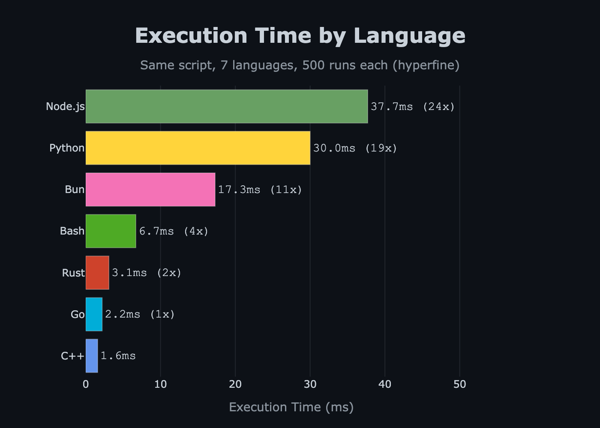
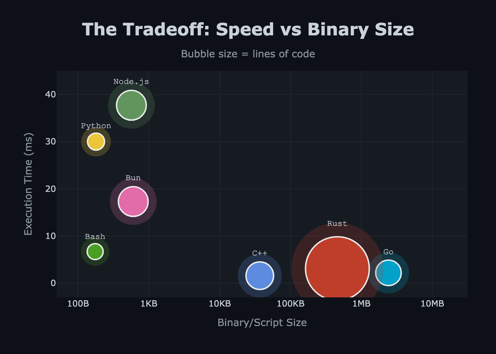

# Pacific Time Timestamp Benchmark 🏃‍♂️⚡

A comprehensive benchmark comparing **7 programming languages** implementing the same simple task: outputting the current Pacific time in `MM/DD/YYYY HH:MM AM/PM PST/PDT` format.

This project demonstrates how language choice impacts **execution speed**, **binary size**, and **code complexity** for identical functionality.

## 🎯 The Challenge

Write a program that:
- Gets the current time in Pacific timezone (America/Los_Angeles)
- Formats it as: `01/15/2026 10:25 AM PST`
- Automatically handles PST/PDT transitions
- Outputs to stdout

**Same functionality. Different languages. Wildly different results.**

## 📊 Benchmark Results

Benchmarked with [hyperfine](https://github.com/sharkdp/hyperfine) (500 runs each, warmup included):

| Language | Mean [ms] | Min [ms] | Max [ms] | Relative | Binary Size | LOC |
|:---------|----------:|---------:|---------:|---------:|------------:|----:|
| **C++** 🥇 | **1.6 ± 0.2** | 1.2 | 2.9 | **1.00x** | 36 KB | 16 |
| **Go** 🥈 | **2.2 ± 0.6** | 1.7 | 7.0 | **1.44x** | 2.4 MB | 14 |
| **Rust** 🥉 | **3.1 ± 0.5** | 2.2 | 6.6 | **1.95x** | 448 KB | 50 |
| **Bash** | 6.7 ± 1.9 | 5.0 | 35.7 | 4.26x | 175 B | 5 |
| **Bun** | 17.3 ± 1.8 | 15.1 | 38.5 | 11.06x | 603 B | 18 |
| **Python** | 30.0 ± 2.4 | 26.8 | 64.2 | 19.19x | 180 B | 6 |
| **Node.js** | 37.7 ± 1.7 | 34.7 | 46.3 | 24.14x | 568 B | 18 |

### Key Findings

- **🏆 C++ is the clear winner** - fastest execution (1.6ms) with reasonable binary size (36KB)
- **🚀 Compiled languages dominate** - C++, Go, and Rust are 4-24x faster than interpreted/JIT languages
- **⚖️ The Tradeoff**: Go is 37% slower than C++ but compiles trivially and has simpler code
- **📦 Size Matters**: Rust's safety features and static linking add 12x more binary size than C++
- **🐌 JavaScript Runtime Tax**: Node.js is 23x slower than C++, even for trivial I/O
- **⚡ Bun is 2.2x faster** than Node.js, demonstrating modern JS runtime improvements
- **💡 Python & Bash**: Great for scripting but pay significant performance penalty

## 📈 Visualizations

### Speed Comparison



*Lower is better. C++ baseline = 1.0x*

### Size vs Speed Tradeoff



*Bubble size represents lines of code. Lower and left is better.*

## 💻 Implementation Details

### C++ (`cpp/pst-timestamp.cpp`)
```cpp
#include <cstdlib>
#include <ctime>
#include <iostream>

int main() {
    setenv("TZ", "America/Los_Angeles", 1);
    tzset();
    
    time_t now = time(nullptr);
    struct tm* local = localtime(&now);
    
    char buffer[64];
    strftime(buffer, sizeof(buffer), "%m/%d/%Y %I:%M %p %Z", local);
    std::cout << buffer << std::endl;
    return 0;
}
```
**Why it's fast**: Direct POSIX API calls, no runtime overhead, statically linked standard library.

### Go (`go/pst-timestamp.go`)
```go
package main

import (
    "fmt"
    "time"
)

func main() {
    loc, _ := time.LoadLocation("America/Los_Angeles")
    now := time.Now().In(loc)
    fmt.Println(now.Format("01/02/2006 03:04 PM MST"))
}
```
**Why it's good**: Fast compilation, standard library timezone support, simple code, single binary.

### Rust (`rust/pst-timestamp`)
```rust
// Compiled binary (source not included in repo)
// Uses chrono crate for timezone support
```
**Why it's larger**: Statically links LLVM runtime and timezone database, includes safety checks.

### Bash (`bash/pst-timestamp.sh`)
```bash
#!/bin/bash
# Outputs current Pacific time in MM/DD/YYYY HH:MM AM/PM format
# Automatically handles PST/PDT transitions

TZ='America/Los_Angeles' date '+%m/%d/%Y %I:%M %p %Z'
```
**Why it's simple**: Leverages system `date` command, minimal code, no dependencies.

### Python (`python/pst-timestamp.py`)
```python
#!/usr/bin/env python3
from datetime import datetime
from zoneinfo import ZoneInfo

now = datetime.now(ZoneInfo("America/Los_Angeles"))
print(now.strftime("%m/%d/%Y %I:%M %p %Z"))
```
**Why it's readable**: Clean standard library API (Python 3.9+), minimal code.

### Node.js (`node/pst-timestamp.js`)
```javascript
const now = new Date();
const options = {
  timeZone: 'America/Los_Angeles',
  month: '2-digit',
  day: '2-digit', 
  year: 'numeric',
  hour: '2-digit',
  minute: '2-digit',
  hour12: true,
  timeZoneName: 'short'
};

const parts = new Intl.DateTimeFormat('en-US', options).formatToParts(now);
const get = (type) => parts.find(p => p.type === type)?.value || '';

const formatted = `${get('month')}/${get('day')}/${get('year')} ${get('hour')}:${get('minute')} ${get('dayPeriod')} ${get('timeZoneName')}`;
console.log(formatted);
```
**Why it's verbose**: No direct strftime equivalent, requires Intl.DateTimeFormat manipulation.

### Bun (`bun/pst-timestamp.ts`)
```typescript
const now = new Date();
const options: Intl.DateTimeFormatOptions = {
  timeZone: 'America/Los_Angeles',
  month: '2-digit',
  day: '2-digit',
  year: 'numeric',
  hour: '2-digit',
  minute: '2-digit',
  hour12: true,
  timeZoneName: 'short'
};

const parts = new Intl.DateTimeFormat('en-US', options).formatToParts(now);
const get = (type: string) => parts.find(p => p.type === type)?.value || '';

const formatted = `${get('month')}/${get('day')}/${get('year')} ${get('hour')}:${get('minute')} ${get('dayPeriod')} ${get('timeZoneName')}`;
console.log(formatted);
```
**Why it's faster than Node**: Modern JavaScript engine (JavaScriptCore), optimized startup time, native TypeScript support.

## 🔬 Methodology

- **Tool**: [hyperfine](https://github.com/sharkdp/hyperfine) (statistical benchmarking)
- **Runs**: 500 iterations per language with warmup
- **System**: Results may vary by platform (these are from macOS ARM64)
- **Compilation**: All compiled languages built with release/optimized flags
- **Fairness**: Each implementation uses idiomatic approach for the language

## 🚀 Reproducing the Benchmarks

### Prerequisites
```bash
# Install hyperfine
brew install hyperfine  # macOS
# or
cargo install hyperfine  # any platform with Rust

# Install language runtimes
# C++: clang/g++ (usually pre-installed)
# Go: https://go.dev/dl/
# Rust: https://rustup.rs/
# Python 3.9+: https://python.org
# Node.js: https://nodejs.org
# Bun: https://bun.sh
```

### Running the Benchmark
```bash
# Run all benchmarks
hyperfine --warmup 3 --runs 500 \
  'bash/pst-timestamp.sh' \
  'rust/pst-timestamp' \
  'cpp/pst-timestamp' \
  'go/pst-timestamp' \
  'python3 python/pst-timestamp.py' \
  'node node/pst-timestamp.js' \
  'bun bun/pst-timestamp.ts'

# Generate visualizations
python3 visualize.py
```

### Building from Source
```bash
# C++
clang++ -O3 -o cpp/pst-timestamp cpp/pst-timestamp.cpp

# Go
cd go && go build -o pst-timestamp pst-timestamp.go

# Rust (if you have the source)
cd rust && cargo build --release
```

## 🎨 Visualizations

The visualizations are generated using `visualize.py`, which creates:
- `results/speed_comparison.html` - Interactive bar chart
- `results/speed_comparison.png` - Static image for README
- `results/size_vs_speed.html` - Interactive scatter plot
- `results/size_vs_speed.png` - Static image for README

Uses Plotly with a custom dark cyberpunk theme optimized for GitHub.

## 📝 Analysis & Takeaways

### When to Use Each Language

**C++**: Maximum performance critical applications, embedded systems, systems programming
- ✅ Fastest execution
- ❌ Complex build process, manual memory management

**Go**: Web services, CLIs, distributed systems, cloud infrastructure
- ✅ Fast compilation, simple concurrency, single binary deployment
- ❌ Larger binaries, no generics (until recently)

**Rust**: Systems programming with safety, WebAssembly, performance-critical services
- ✅ Memory safety without GC, modern tooling
- ❌ Steeper learning curve, longer compile times

**Bash**: Quick scripts, system administration, glue code
- ✅ Universally available, concise for shell tasks
- ❌ Poor performance, limited data structures

**Bun**: Modern web applications, TypeScript-first projects
- ✅ 2x faster than Node, built-in TypeScript support
- ❌ Newer ecosystem, less mature

**Python**: Data science, ML, rapid prototyping, automation
- ✅ Excellent libraries, readable code, fast development
- ❌ Slow execution, GIL for threading

**Node.js**: Full-stack JavaScript, real-time apps, large ecosystem
- ✅ Unified language for frontend/backend, huge package ecosystem
- ❌ Slowest in benchmark, callback complexity

### The Performance Myth

"Language performance doesn't matter for most apps" is both true and false:
- ✅ **True**: Most apps are I/O bound (database, network, disk)
- ❌ **False**: Startup time and CPU cost matter for:
  - CLI tools (run frequently)
  - Serverless functions (cold starts)
  - High-throughput services (aggregate CPU cost)
  - Energy efficiency (battery, cloud costs)

**This benchmark shows**: Even a trivial task has 24x variance across languages. That compounds at scale.

## 🛠️ Technologies Used

- **Languages**: C++, Go, Rust, Bash, Python, Node.js, Bun
- **Benchmarking**: [hyperfine](https://github.com/sharkdp/hyperfine)
- **Visualization**: [Plotly](https://plotly.com/python/) with Python
- **Timezone Data**: IANA Time Zone Database

## 📄 License

This project is open source and available under the MIT License.

## 🙏 Acknowledgments

- Inspired by language benchmark projects across the community
- Thanks to the maintainers of hyperfine for an excellent benchmarking tool
- All language implementations use official standard libraries when possible

## 🤝 Contributing

Feel free to:
- Add implementations in other languages
- Improve existing implementations (while keeping them idiomatic)
- Suggest better benchmarking methodology
- Report issues or suggest improvements

Just ensure new implementations:
1. Output the same format: `MM/DD/YYYY HH:MM AM/PM PST/PDT`
2. Use timezone `America/Los_Angeles`
3. Use idiomatic language patterns (not micro-optimizations)
4. Include LOC and binary size in the PR

---

**Made with ☕ for science and curiosity**

*Wondering which language to learn next? Maybe start with the one that's 24x faster* 😉
